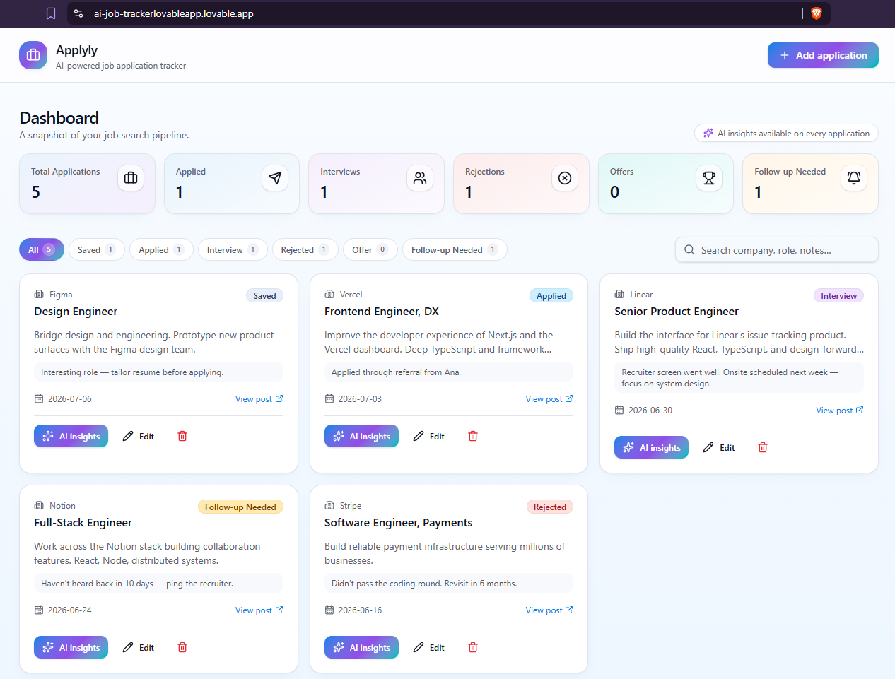
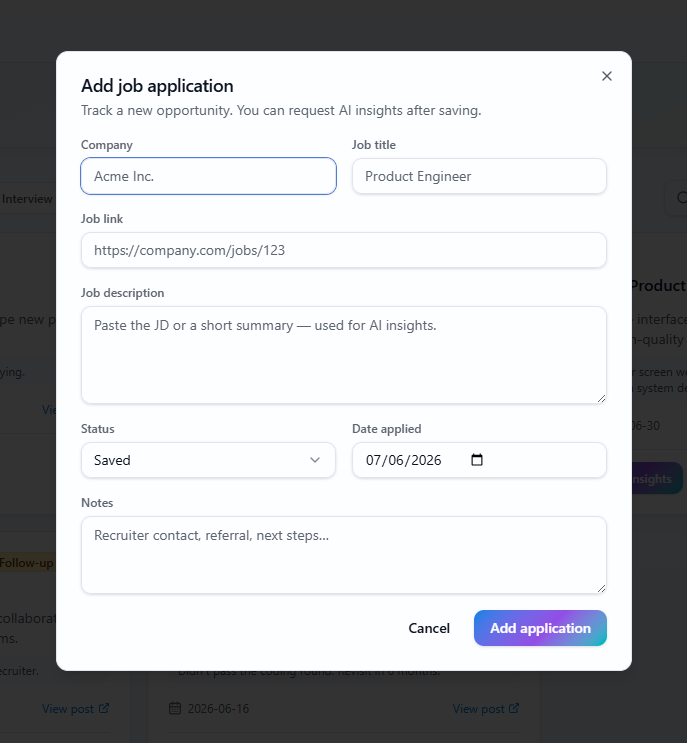
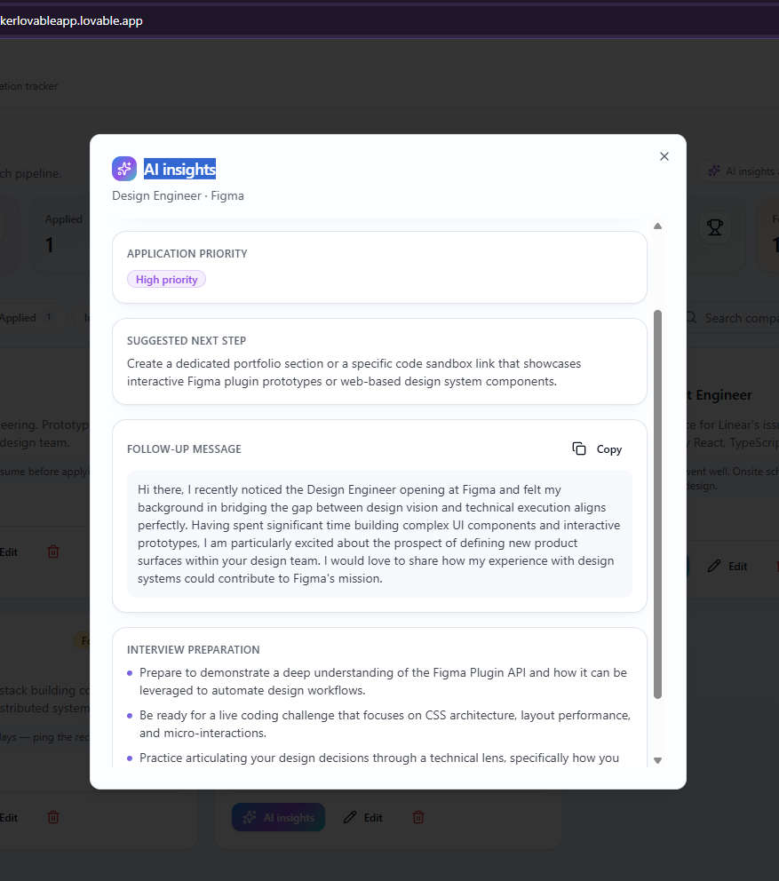

# 🚀 Applyly – AI Job Application Tracker

AI-powered job application tracker that helps job seekers organize applications, monitor progress, generate AI insights, and prepare for interviews.

---

## 🚀 Live Demo

https://ai-job-trackerlovableapp.lovable.app/

---

## 📋 Overview

Applyly is an AI-powered application designed to help job seekers organize their entire job search process in one place.

Instead of managing applications in spreadsheets or notes, users can track opportunities, monitor progress, and receive AI-powered recommendations for each application.

---

## ✨ Features

- Track job applications
- Organize applications by status
- AI Match Summary
- Application Priority
- AI-generated Follow-up Messages
- Interview Preparation Tips
- Fast Search
- Clean Dashboard

---

## 🛠 Tech Stack

- Lovable
- React
- TypeScript
- Supabase
- AI Prompt Engineering

---

## 📸 Screenshots

### Dashboard

### Add Application

### AI Insights

---

## 💼 Use Cases

Applyly helps job seekers:

- Organize applications
- Prioritize opportunities
- Prepare for interviews
- Generate professional follow-up messages
- Track their hiring pipeline

---

## 🔮 Future Improvements

- Resume Upload
- AI Resume Analysis
- Cover Letter Generator    
- Email Integration
- Calendar Reminders
- Analytics Dashboard   
